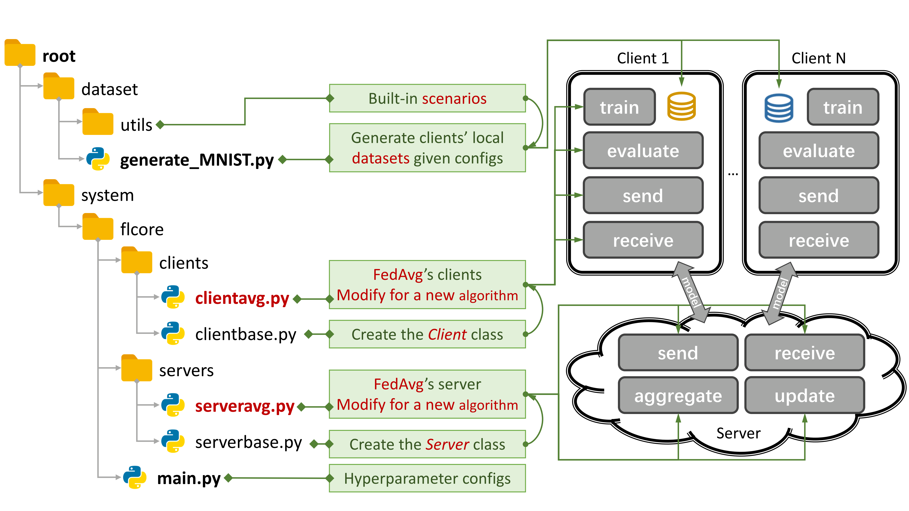

# PFLlib: Personalized Federated Learning Algorithm Library

[](https://www.gnu.org/licenses/old-licenses/gpl-2.0.en.html) [](https://arxiv.org/abs/2312.04992)


Figure 1: An Example for FedAvg. You can create a scenario using `generate_DATA.py` and run an algorithm using `main.py`, `clientNAME.py`, and `serverNAME.py`. 

***We expose this user-friendly algorithm library (with an integrated evaluation platform) for beginners who intend to start federated learning (FL) study.***

- ***34 traditional FL ([tFL](#traditional-fl-tfl)) or personalized FL ([pFL](#personalized-fl-pfl)) algorithms, 3 scenarios, and 20 datasets**.*

- Some **experimental results** are avalible [here](#experimental-results). 

- Refer to [this guide](#how-to-start-simulating-examples-for-fedavg) to learn how to use it.

- *This library can simulate scenarios using the 4-layer CNN on Cifar100 for **500 clients** on **one NVIDIA GeForce RTX 3090 GPU card** with only **5.08GB GPU memory** cost.*

- PFLlib primarily focuses on data (statistical) heterogeneity. For algorithms and an evaluation platform that address **both data and model heterogeneity**, please refer to our extended project **[Heterogeneous Federated Learning (HtFL)](https://github.com/TsingZ0/HtFL)**.

- As we strive to meet diverse user demands, frequent updates to the project may alter default settings and scenario creation codes, affecting experimental results.
  
- [Closed issues](https://github.com/TsingZ0/PFLlib/issues?q=is%3Aissue+is%3Aclosed) may help you a lot.

- When submitting pull requests, please provide sufficient *instructions* and *examples* in the comment box. 

The origin of the **statistical heterogeneity** phenomenon is the personalization of users, who generate non-IID (not Independent and Identically Distributed) and unbalanced data. With statistical heterogeneity existing in the FL scenario, a myriad of approaches have been proposed to crack this hard nut. In contrast, the personalized FL (pFL) may take advantage of the statistically heterogeneous data to learn the personalized model for each user. 

Thanks to [@Stonesjtu](https://github.com/Stonesjtu/pytorch_memlab/blob/d590c489236ee25d157ff60ecd18433e8f9acbe3/pytorch_memlab/mem_reporter.py#L185), this library can also record the **GPU memory usage** for the model. Following [FedCG](https://www.ijcai.org/proceedings/2022/0324.pdf), we also introduce the **[DLG (Deep Leakage from Gradients)](https://papers.nips.cc/paper_files/paper/2019/hash/60a6c4002cc7b29142def8871531281a-Abstract.html) attack** and **PSNR (Peak Signal-to-Noise Ratio) metric** to evaluate the privacy-preserving ability of tFL/pFL algorithms (please refer to `./system/flcore/servers/serveravg.py` for example). *Now we can train on some clients and evaluate performance on other new clients by setting `args.num_new_clients` in `./system/main.py`. Note that not all the tFL/pFL algorithms support this feature.*

**Citation**

```
@article{zhang2023pfllib,
  title={PFLlib: Personalized Federated Learning Algorithm Library},
  author={Zhang, Jianqing and Liu, Yang and Hua, Yang and Wang, Hao and Song, Tao and Xue, Zhengui and Ma, Ruhui and Cao, Jian},
  journal={arXiv preprint arXiv:2312.04992},
  year={2023}
}
```


## Algorithms with code (updating)

> ### Traditional FL (tFL)

- **FedAvg** — [Communication-Efficient Learning of Deep Networks from Decentralized Data](http://proceedings.mlr.press/v54/mcmahan17a.html) *AISTATS 2017*

  ***Update-correction-based tFL***

- **SCAFFOLD** - [SCAFFOLD: Stochastic Controlled Averaging for Federated Learning](http://proceedings.mlr.press/v119/karimireddy20a.html) *ICML 2020*

  ***Regularization-based tFL***

- **FedProx** — [Federated Optimization in Heterogeneous Networks](https://arxiv.org/abs/1812.06127) *MLsys 2020*
- **FedDyn** — [Federated Learning Based on Dynamic Regularization](https://openreview.net/forum?id=B7v4QMR6Z9w) *ICLR 2021*

  ***Model-splitting-based tFL***

- **MOON** — [Model-Contrastive Federated Learning](https://openaccess.thecvf.com/content/CVPR2021/html/Li_Model-Contrastive_Federated_Learning_CVPR_2021_paper.html) *CVPR 2021*

  ***Knowledge-distillation-based tFL***

- **FedGen** — [Data-Free Knowledge Distillation for Heterogeneous Federated Learning](http://proceedings.mlr.press/v139/zhu21b.html) *ICML 2021*
- **FedNTD** — [Preservation of the Global Knowledge by Not-True Distillation in Federated Learning](https://proceedings.neurips.cc/paper_files/paper/2022/hash/fadec8f2e65f181d777507d1df69b92f-Abstract-Conference.html) *NeurIPS 2022*

> ### Personalized FL (pFL)

- **FedMTL (not MOCHA)** — [Federated multi-task learning](https://papers.nips.cc/paper/2017/hash/6211080fa89981f66b1a0c9d55c61d0f-Abstract.html) *NeurIPS 2017*
- **FedBN** — [FedBN: Federated Learning on non-IID Features via Local Batch Normalization](https://openreview.net/forum?id=6YEQUn0QICG) *ICLR 2021*

  ***Meta-learning-based pFL***

- **Per-FedAvg** — [Personalized Federated Learning with Theoretical Guarantees: A Model-Agnostic Meta-Learning Approach](https://proceedings.neurips.cc/paper/2020/hash/24389bfe4fe2eba8bf9aa9203a44cdad-Abstract.html) *NeurIPS 2020*

  ***Regularization-based pFL***
  
- **pFedMe** — [Personalized Federated Learning with Moreau Envelopes](https://papers.nips.cc/paper/2020/hash/f4f1f13c8289ac1b1ee0ff176b56fc60-Abstract.html) *NeurIPS 2020*
- **Ditto** — [Ditto: Fair and robust federated learning through personalization](https://proceedings.mlr.press/v139/li21h.html) *ICML 2021*

  ***Personalized-aggregation-based pFL***

- **APFL** — [Adaptive Personalized Federated Learning](https://arxiv.org/abs/2003.13461) *2020* 
- **FedFomo** — [Personalized Federated Learning with First Order Model Optimization](https://openreview.net/forum?id=ehJqJQk9cw) *ICLR 2021*
- **FedAMP** — [Personalized Cross-Silo Federated Learning on non-IID Data](https://ojs.aaai.org/index.php/AAAI/article/view/16960) *AAAI 2021*
- **FedPHP** — [FedPHP: Federated Personalization with Inherited Private Models](https://link.springer.com/chapter/10.1007/978-3-030-86486-6_36) *ECML PKDD 2021*
- **APPLE** — [Adapt to Adaptation: Learning Personalization for Cross-Silo Federated Learning](https://www.ijcai.org/proceedings/2022/301) *IJCAI 2022*
- **FedALA** — [FedALA: Adaptive Local Aggregation for Personalized Federated Learning](https://ojs.aaai.org/index.php/AAAI/article/view/26330) *AAAI 2023* 

  ***Model-splitting-based pFL***

- **FedPer** — [Federated Learning with Personalization Layers](https://arxiv.org/abs/1912.00818) *2019*
- **LG-FedAvg** — [Think Locally, Act Globally: Federated Learning with Local and Global Representations](https://arxiv.org/abs/2001.01523) *2020*
- **FedRep** — [Exploiting Shared Representations for Personalized Federated Learning](http://proceedings.mlr.press/v139/collins21a.html) *ICML 2021*
- **FedRoD** — [On Bridging Generic and Personalized Federated Learning for Image Classification](https://openreview.net/forum?id=I1hQbx10Kxn) *ICLR 2022*
- **FedBABU** — [Fedbabu: Towards enhanced representation for federated image classification](https://openreview.net/forum?id=HuaYQfggn5u) *ICLR 2022*
- **FedGC** — [Federated Learning for Face Recognition with Gradient Correction](https://ojs.aaai.org/index.php/AAAI/article/view/20095/19854) *AAAI 2022*
- **FedCP** — [FedCP: Separating Feature Information for Personalized Federated Learning via Conditional Policy](https://arxiv.org/pdf/2307.01217v2.pdf) *KDD 2023*
- **GPFL** — [GPFL: Simultaneously Learning Generic and Personalized Feature Information for Personalized Federated Learning](https://arxiv.org/pdf/2308.10279v3.pdf) *ICCV 2023*
- **FedGH** — [FedGH: Heterogeneous Federated Learning with Generalized Global Header](https://dl.acm.org/doi/10.1145/3581783.3611781) *ACM MM 2023*
- **DBE** — [Eliminating Domain Bias for Federated Learning in Representation Space](https://openreview.net/forum?id=nO5i1XdUS0) *NeurIPS 2023*
- **FedCAC** — [Bold but Cautious: Unlocking the Potential of Personalized Federated Learning through Cautiously Aggressive Collaboration](https://arxiv.org/abs/2309.11103) *ICCV 2023*

  ***Knowledge-distillation-based pFL***

- **FedDistill (FD)** — [Communication-Efficient On-Device Machine Learning: Federated Distillation and Augmentation under Non-IID Private Data](https://arxiv.org/pdf/1811.11479.pdf) *2018*
- **FML** — [Federated Mutual Learning](https://arxiv.org/abs/2006.16765) *2020*
- **FedKD** — [Communication-efficient federated learning via knowledge distillation](https://www.nature.com/articles/s41467-022-29763-x) *Nature Communications 2022*
- **FedProto** — [FedProto: Federated Prototype Learning across Heterogeneous Clients](https://ojs.aaai.org/index.php/AAAI/article/view/20819) *AAAI 2022*
- **FedPCL (w/o pre-trained models)** — [Federated learning from pre-trained models: A contrastive learning approach](https://proceedings.neurips.cc/paper_files/paper/2022/file/7aa320d2b4b8f6400b18f6f77b6c1535-Paper-Conference.pdf) *NeurIPS 2022* 
- **FedPAC** — [Personalized Federated Learning with Feature Alignment and Classifier Collaboration](https://openreview.net/pdf?id=SXZr8aDKia) *ICLR 2023*

## Datasets and scenarios (updating)
For the ***label skew*** scenario, we introduce **14** famous datasets: **MNIST**, **EMNIST**, **Fashion-MNIST**, **Cifar10**, **Cifar100**, **AG News**, **Sogou News**, **Tiny-ImageNet**, **Country211**, **Flowers102**, **GTSRB**, **Shakespeare**, and **Stanford Cars**, they can be easy split into **IID** and **non-IID** version. Since some codes for generating datasets such as splitting are the same for all datasets, we move these codes into `./dataset/utils/dataset_utils.py`. In the **non-IID** scenario, 2 situations exist. The first one is the **pathological non-IID** scenario, the second one is the **practical non-IID** scenario. In the **pathological non-IID** scenario, for example, the data on each client only contains the specific number of labels (maybe only 2 labels), though the data on all clients contains 10 labels such as the MNIST dataset. In the **practical non-IID** scenario, Dirichlet distribution is utilized (please refer to this [paper](https://proceedings.neurips.cc/paper/2020/hash/18df51b97ccd68128e994804f3eccc87-Abstract.html) for details). We can input `balance` for the iid scenario, where the data are uniformly distributed. 

For the ***feature shift*** scenario, we use **3** datasets that are widely used in Domain Adaptation: **Amazon Review** (fetch raw data from [this site](https://drive.google.com/file/d/1QbXFENNyqor1IlCpRRFtOluI2_hMEd1W/view?usp=sharing)), **Digit5** (fetch raw data from [this site](https://drive.google.com/file/d/1PT6K-_wmsUEUCxoYzDy0mxF-15tvb2Eu/view?usp=share_link)), and **DomainNet**.

For the ***real-world (or IoT)*** scenario, we also introduce **3** naturally separated datasets: **Omniglot** (20 clients, 50 labels), **HAR (Human Activity Recognition)** (30 clients, 6 labels), **PAMAP2** (9 clients, 12 labels). For the details of datasets and FL algorithms in **IoT**, please refer to [my FL-IoT repo](https://github.com/TsingZ0/FL-IoT).

*If you need another data set, just write another code to download it and then use the utils.*

### Examples for **MNIST**
- MNIST
    ```
    cd ./dataset
    # python generate_MNIST.py iid - - # for iid and unbalanced scenario
    # python generate_MNIST.py iid balance - # for iid and balanced scenario
    # python generate_MNIST.py noniid - pat # for pathological noniid and unbalanced scenario
    python generate_MNIST.py noniid - dir # for practical noniid and unbalanced scenario
    # python generate_MNIST.py noniid - exdir # for Extended Dirichlet strategy 
    ```

The output of `python generate_MNIST.py noniid - dir`
```
Number of classes: 10
Client 0         Size of data: 2630      Labels:  [0 1 4 5 7 8 9]
                 Samples of labels:  [(0, 140), (1, 890), (4, 1), (5, 319), (7, 29), (8, 1067), (9, 184)]
--------------------------------------------------
Client 1         Size of data: 499       Labels:  [0 2 5 6 8 9]
                 Samples of labels:  [(0, 5), (2, 27), (5, 19), (6, 335), (8, 6), (9, 107)]
--------------------------------------------------
Client 2         Size of data: 1630      Labels:  [0 3 6 9]
                 Samples of labels:  [(0, 3), (3, 143), (6, 1461), (9, 23)]
--------------------------------------------------
```
<details>
    <summary>Show more</summary>

    Client 3         Size of data: 2541      Labels:  [0 4 7 8]
                     Samples of labels:  [(0, 155), (4, 1), (7, 2381), (8, 4)]
    --------------------------------------------------
    Client 4         Size of data: 1917      Labels:  [0 1 3 5 6 8 9]
                     Samples of labels:  [(0, 71), (1, 13), (3, 207), (5, 1129), (6, 6), (8, 40), (9, 451)]
    --------------------------------------------------
    Client 5         Size of data: 6189      Labels:  [1 3 4 8 9]
                     Samples of labels:  [(1, 38), (3, 1), (4, 39), (8, 25), (9, 6086)]
    --------------------------------------------------
    Client 6         Size of data: 1256      Labels:  [1 2 3 6 8 9]
                     Samples of labels:  [(1, 873), (2, 176), (3, 46), (6, 42), (8, 13), (9, 106)]
    --------------------------------------------------
    Client 7         Size of data: 1269      Labels:  [1 2 3 5 7 8]
                     Samples of labels:  [(1, 21), (2, 5), (3, 11), (5, 787), (7, 4), (8, 441)]
    --------------------------------------------------
    Client 8         Size of data: 3600      Labels:  [0 1]
                     Samples of labels:  [(0, 1), (1, 3599)]
    --------------------------------------------------
    Client 9         Size of data: 4006      Labels:  [0 1 2 4 6]
                     Samples of labels:  [(0, 633), (1, 1997), (2, 89), (4, 519), (6, 768)]
    --------------------------------------------------
    Client 10        Size of data: 3116      Labels:  [0 1 2 3 4 5]
                     Samples of labels:  [(0, 920), (1, 2), (2, 1450), (3, 513), (4, 134), (5, 97)]
    --------------------------------------------------
    Client 11        Size of data: 3772      Labels:  [2 3 5]
                     Samples of labels:  [(2, 159), (3, 3055), (5, 558)]
    --------------------------------------------------
    Client 12        Size of data: 3613      Labels:  [0 1 2 5]
                     Samples of labels:  [(0, 8), (1, 180), (2, 3277), (5, 148)]
    --------------------------------------------------
    Client 13        Size of data: 2134      Labels:  [1 2 4 5 7]
                     Samples of labels:  [(1, 237), (2, 343), (4, 6), (5, 453), (7, 1095)]
    --------------------------------------------------
    Client 14        Size of data: 5730      Labels:  [5 7]
                     Samples of labels:  [(5, 2719), (7, 3011)]
    --------------------------------------------------
    Client 15        Size of data: 5448      Labels:  [0 3 5 6 7 8]
                     Samples of labels:  [(0, 31), (3, 1785), (5, 16), (6, 4), (7, 756), (8, 2856)]
    --------------------------------------------------
    Client 16        Size of data: 3628      Labels:  [0]
                     Samples of labels:  [(0, 3628)]
    --------------------------------------------------
    Client 17        Size of data: 5653      Labels:  [1 2 3 4 5 7 8]
                     Samples of labels:  [(1, 26), (2, 1463), (3, 1379), (4, 335), (5, 60), (7, 17), (8, 2373)]
    --------------------------------------------------
    Client 18        Size of data: 5266      Labels:  [0 5 6]
                     Samples of labels:  [(0, 998), (5, 8), (6, 4260)]
    --------------------------------------------------
    Client 19        Size of data: 6103      Labels:  [0 1 2 3 4 9]
                     Samples of labels:  [(0, 310), (1, 1), (2, 1), (3, 1), (4, 5789), (9, 1)]
    --------------------------------------------------
    Total number of samples: 70000
    The number of train samples: [1972, 374, 1222, 1905, 1437, 4641, 942, 951, 2700, 3004, 2337, 2829, 2709, 1600, 4297, 4086, 2721, 4239, 3949, 4577]
    The number of test samples: [658, 125, 408, 636, 480, 1548, 314, 318, 900, 1002, 779, 943, 904, 534, 1433, 1362, 907, 1414, 1317, 1526]

    Saving to disk.

    Finish generating dataset.
</details>

## Models
- for MNIST and Fashion-MNIST

    1. Mclr_Logistic(1\*28\*28)
    2. LeNet()
    3. DNN(1\*28\*28, 100) # non-convex

- for Cifar10, Cifar100 and Tiny-ImageNet

    1. Mclr_Logistic(3\*32\*32)
    2. FedAvgCNN()
    3. DNN(3\*32\*32, 100) # non-convex
    4. ResNet18, AlexNet, MobileNet, GoogleNet, etc.

- for AG_News and Sogou_News

    1. LSTM()
    2. fastText() in [Bag of Tricks for Efficient Text Classification](https://aclanthology.org/E17-2068/) 
    3. TextCNN() in [Convolutional Neural Networks for Sentence Classification](https://aclanthology.org/D14-1181/)
    4. TransformerModel() in [Attention is all you need](https://proceedings.neurips.cc/paper/2017/hash/3f5ee243547dee91fbd053c1c4a845aa-Abstract.html)

- for AmazonReview

    1. AmazonMLP() in [Curriculum manager for source selection in multi-source domain adaptation](https://link.springer.com/chapter/10.1007/978-3-030-58568-6_36)

- for Omniglot

    1. FedAvgCNN()

- for HAR and PAMAP

    1. HARCNN() in [Convolutional neural networks for human activity recognition using mobile sensors](https://eudl.eu/pdf/10.4108/icst.mobicase.2014.257786)

## Environments
Install [CUDA](https://developer.nvidia.com/cuda-11-6-0-download-archive). 

Install [conda](https://repo.anaconda.com/miniconda/Miniconda3-latest-Linux-x86_64.sh) and activate conda. 

```bash
conda env create -f env_cuda_latest.yaml # You may need to downgrade the torch using pip to match the CUDA version
```

## How to start simulating (examples for FedAvg)

- Create proper environments (see [Environments](#environments)).

- Download [this project](https://github.com/TsingZ0/PFLlib) to an appropriate location using [git](https://git-scm.com/).
    ```bash
    git clone https://github.com/TsingZ0/PFLlib.git
    ```

- Build evaluation scenarios (see [Datasets and scenarios (updating)](#datasets-and-scenarios-updating)).

- Run evaluation: 
    ```bash
    cd ./system
    python main.py -data MNIST -m cnn -algo FedAvg -gr 2000 -did 0 # using the MNIST dataset, the FedAvg algorithm, and the 4-layer CNN model
    ```

**Note**: It is preferable to tune algorithm-specific hyper-parameters before using any algorithm on a new machine. 

## Practical situations
If you need to simulate FL under practical situations, which includes **client dropout**, **slow trainers**, **slow senders**, and **network TTL**, you can set the following parameters to realize it.

- `-cdr`: The dropout rate for total clients. The selected clients will randomly drop at each training round.
- `-tsr` and `-ssr`: The rates for slow trainers and slow senders among all clients. Once a client is selected as a "slow trainer"/"slow sender", for example, it will always train/send slower than the original one. 
- `-tth`: The threshold for network TTL (ms). 

## Easy to extend
It is easy to add new algorithms and datasets to this library. 

- To add a **new dataset** into this library, all you need to do is write the download code and use the utils which is similar to `./dataset/generate_MNIST.py` (you can also consider it as the template). 

- To add a **new algorithm**, you can utilize the class **Server** and class **Client**, which are wrote in `./system/flcore/servers/serverbase.py` and `./system/flcore/clients/clientbase.py`, respectively. 

- To add a **new model**, just add it into `./system/flcore/trainmodel/models.py`.

- If you have a **new optimizer** while training, please add it into `./system/flcore/optimizers/fedoptimizer.py`

- The evaluation platform is also convenient for users to build a new platform for specific applications, such as our [FL-IoT](https://github.com/TsingZ0/FL-IoT) and [HtFL](https://github.com/TsingZ0/HtFL). 


## Experimental results

If you are interested in **the experimental results (e.g., the accuracy) of the above algorithms**, you can find some results in our accepted FL papers (i.e., [FedALA](https://github.com/TsingZ0/FedALA), [FedCP](https://github.com/TsingZ0/FedCP), [GPFL](https://github.com/TsingZ0/GPFL), and [DBE](https://github.com/TsingZ0/DBE)) listed as follows that also use this library. *Please note that this developing project may not be able to reproduce the results on these papers, since some basic settings may change due to the requests of the community. For example, we previously set `shuffle=False` in clientbase.py* 

```
@inproceedings{zhang2023fedala,
  title={Fedala: Adaptive local aggregation for personalized federated learning},
  author={Zhang, Jianqing and Hua, Yang and Wang, Hao and Song, Tao and Xue, Zhengui and Ma, Ruhui and Guan, Haibing},
  booktitle={Proceedings of the AAAI Conference on Artificial Intelligence},
  volume={37},
  number={9},
  pages={11237--11244},
  year={2023}
}

@inproceedings{Zhang2023fedcp,
  author = {Zhang, Jianqing and Hua, Yang and Wang, Hao and Song, Tao and Xue, Zhengui and Ma, Ruhui and Guan, Haibing},
  title = {FedCP: Separating Feature Information for Personalized Federated Learning via Conditional Policy},
  year = {2023},
  booktitle = {Proceedings of the 29th ACM SIGKDD Conference on Knowledge Discovery and Data Mining}
}

@inproceedings{zhang2023gpfl,
  title={GPFL: Simultaneously Learning Global and Personalized Feature Information for Personalized Federated Learning},
  author={Zhang, Jianqing and Hua, Yang and Wang, Hao and Song, Tao and Xue, Zhengui and Ma, Ruhui and Cao, Jian and Guan, Haibing},
  booktitle={Proceedings of the IEEE/CVF International Conference on Computer Vision},
  pages={5041--5051},
  year={2023}
}

@inproceedings{
  zhang2023eliminating,
  title={Eliminating Domain Bias for Federated Learning in Representation Space},
  author={Jianqing Zhang and Yang Hua and Jian Cao and Hao Wang and Tao Song and Zhengui XUE and Ruhui Ma and Haibing Guan},
  booktitle={Thirty-seventh Conference on Neural Information Processing Systems},
  year={2023},
  url={https://openreview.net/forum?id=nO5i1XdUS0}
}
```
